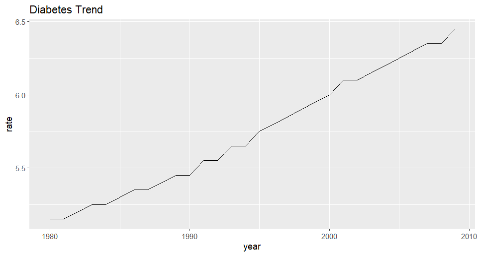
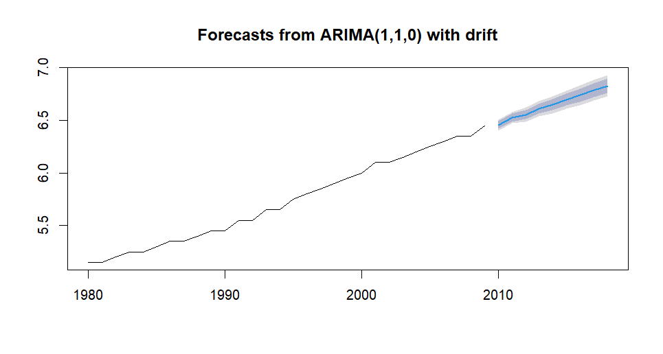
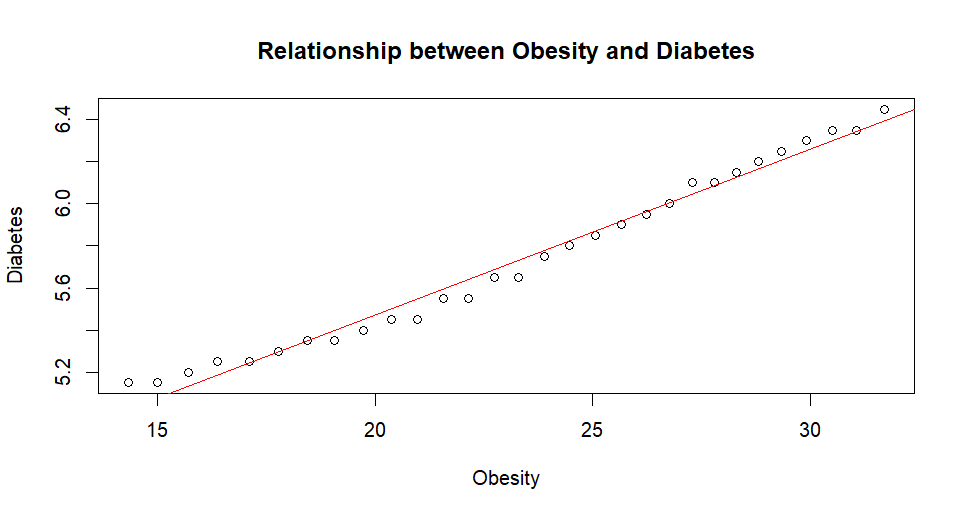

# Diabetes-Obesity-Time-Series.R
## Project Title
Time Series Analysis of Diabetes Trend and Its Relationship With Obesity in Saudi Arabia

## 📊 Overview
This project analyzes the trend of diabetes in Saudi Arabia and examines its relationship with obesity using time series models and statistical analysis.

## 📁 Dataset
The dataset used in this project is part of a larger health indicators collection titled “Health Indicators”.
The dataset consists of multiple Excel files covering various health metrics in Saudi Arabia. This study specifically uses the non-communicable diseases dataset,
which includes indicators such as diabetes and obesity rates.
The data spans from 1975 to 2019 and was aggregated annually for analysis.

🔗 Source: [https://www.kaggle.com/datasets/thedevastator/saudi-arabia-health-indicators]

## ⚙️ Methods
The analysis was conducted using R and includes the following steps:

- Data cleaning and preparation
- Time series modeling using ARIMA
- Forecasting future diabetes trends
- Modeling using Facebook Prophet
- Correlation analysis between obesity and diabetes
- Linear regression to examine the relationship between the two variables

---

## 📈 Results
- Diabetes rates show a clear increasing trend over time.
- ARIMA and Prophet models indicate continued growth in future diabetes prevalence.
- A very strong positive correlation was found between obesity and diabetes (r ≈ 0.98).
- Linear regression analysis confirms that higher obesity rates are associated with higher diabetes rates.

---

## 🛠️ Tools & Technologies
- R
- forecast package (ARIMA)
- prophet package
- ggplot2

## 📊 Visualizations
### Diabetes Trend Over Time

### ARIMA Forecast

### Obesity vs Diabetes Relationship

